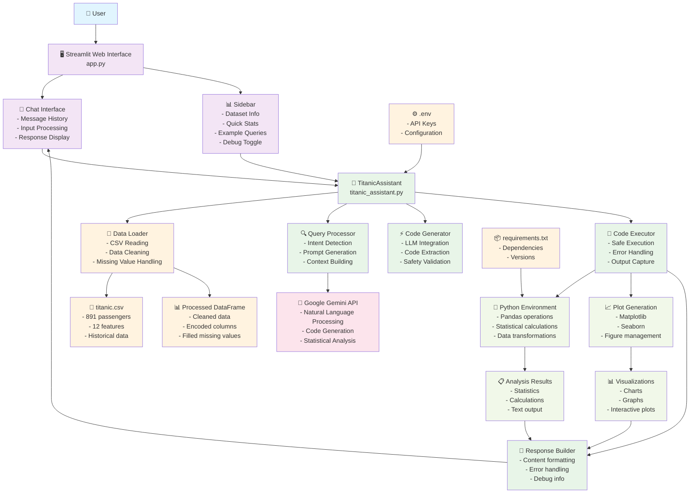
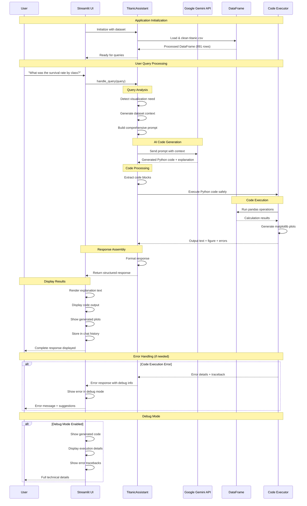

# 🛳️ Titanic Dataset Explorer

An intelligent Streamlit application that makes the famous Titanic dataset queryable using Google Gemini AI. Ask questions in natural language and get instant statistical analysis and visualizations about the passengers aboard the RMS Titanic.


*Interactive demo showing natural language queries and AI-generated analysis*


## ✨ Features

- 🤖 **Natural Language Queries**: Ask questions in plain English
- 📊 **Automatic Visualizations**: Generate plots and charts automatically
- 📈 **Statistical Analysis**: Get detailed statistics and comparisons
- 🔍 **Interactive Interface**: User-friendly Streamlit web interface
- 🐛 **Debug Mode**: Toggle detailed error information for troubleshooting
- 📱 **Responsive Design**: Works on desktop and mobile devices

## 🚀 Quick Start

### Prerequisites

- Python 3.8 or higher
- Google Gemini API key (free from [Google AI Studio](https://makersuite.google.com/app/apikey))

### Installation

1. **Clone the repository**
   ```bash
   git clone <your-repo-url>
   cd titanic-dataset-explorer
   ```

2. **Install dependencies**
   ```bash
   pip install -r requirements.txt
   ```

3. **Set up environment variables**
   
   Create a `.env` file in the project root:
   ```bash
   GOOGLE_API_KEY=your_gemini_api_key_here
   ```

4. **Ensure you have the Titanic dataset**
   
   Make sure `titanic.csv` is in the project root directory. The app expects a standard Titanic dataset with these columns:
   - PassengerId, Survived, Pclass, Name, Sex, Age, SibSp, Parch, Ticket, Fare, Cabin, Embarked

5. **Run the application**
   ```bash
   streamlit run app.py
   ```

6. **Open your browser**
   
   Navigate to `http://localhost:8501` to start exploring!

## 💡 Example Queries

Here are some questions you can ask:

### 📊 Statistical Analysis
- "What was the survival rate by passenger class?"
- "Compare survival rates between men and women"
- "What's the average age of survivors vs non-survivors?"
- "Show me fare distribution by class"

### 📈 Visualizations
- "Plot age distribution by gender"
- "Show survival rates by class and gender"
- "Create a histogram of passenger ages"
- "Visualize the relationship between age and fare"

### 🔍 Data Exploration
- "How many passengers embarked from each port?"
- "What was the most expensive ticket?"
- "Show me passengers with the most family members"
- "Which passenger class had the highest survival rate?"

## 🏗️ Project Structure

```
titanic-dataset-explorer/
├── app.py                 # Main Streamlit application
├── titanic_assistant.py   # Core AI assistant logic
├── titanic.csv           # Titanic dataset
├── requirements.txt      # Python dependencies
├── .env                 # Environment variables (create this)
├── .gitignore           # Git ignore rules
└── README.md           # This file
```

## 🔧 Configuration

### Environment Variables

| Variable | Description | Required |
|----------|-------------|----------|
| `GOOGLE_API_KEY` | Your Google Gemini API key | Yes |

### Getting a Gemini API Key

1. Visit [Google AI Studio](https://makersuite.google.com/app/apikey)
2. Sign in with your Google account
3. Click "Create API Key"
4. Copy the key and add it to your `.env` file

## 🛠️ Technical Details

### Architecture

- **Frontend**: Streamlit web interface
- **AI Engine**: Google Gemini 1.5 Flash for code generation
- **Data Processing**: Pandas for data manipulation
- **Visualization**: Matplotlib and Seaborn for plots
- **Code Execution**: Safe execution environment with error handling

### Key Components

1. **TitanicAssistant Class**
   - Loads and preprocesses the dataset
   - Handles natural language queries
   - Generates and executes Python code
   - Creates visualizations

2. **Streamlit App**
   - Provides the web interface
   - Manages chat history
   - Displays results and visualizations
   - Handles user interactions

### Data Preprocessing

The app automatically handles:
- Missing value imputation (Age: median, Fare: median, Embarked: most common)
- Data type validation
- Column encoding for analysis while preserving original values
- Error handling for data inconsistencies

## 🏗️ Architecture

### System Overview


### Data Flow Process


## 🐛 Troubleshooting

### Common Issues

1. **"GOOGLE_API_KEY environment variable is not set"**
   - Make sure you created a `.env` file with your API key
   - Check that the variable name is exactly `GOOGLE_API_KEY`

2. **"Could not load the Titanic dataset"**
   - Ensure `titanic.csv` is in the project root directory
   - Check that the CSV has the expected columns

3. **Code execution errors**
   - Enable debug mode in the sidebar to see detailed error information
   - Check that your query is clear and specific

4. **Plots not displaying**
   - Try refreshing the page
   - Check the debug information for matplotlib errors

### Debug Mode

Enable debug mode in the sidebar to see:
- Full error tracebacks
- Generated Python code
- Execution details
- Dataset information

## 🤝 Contributing

Contributions are welcome! Here are some ways to improve the project:

- Add support for more chart types
- Implement advanced statistical analysis
- Add data export functionality
- Improve error handling
- Add more example queries
- Enhance the UI/UX

### Development Setup

1. Fork the repository
2. Create a feature branch
3. Make your changes
4. Test thoroughly
5. Submit a pull request

## 📄 License

This project is open source and available under the [MIT License](LICENSE).

## 🙏 Acknowledgments

- **Titanic Dataset**: From Kaggle's famous machine learning competition
- **Google Gemini**: For providing the AI capabilities
- **Streamlit**: For the excellent web framework
- **Pandas/Matplotlib/Seaborn**: For data processing and visualization

## 📞 Support

If you encounter issues or have questions:

1. Check the troubleshooting section above
2. Enable debug mode to get detailed error information
3. Create an issue on GitHub with:
   - Your Python version
   - Error messages (with debug mode enabled)
   - Steps to reproduce the problem

---

**Happy exploring! 🚢**
